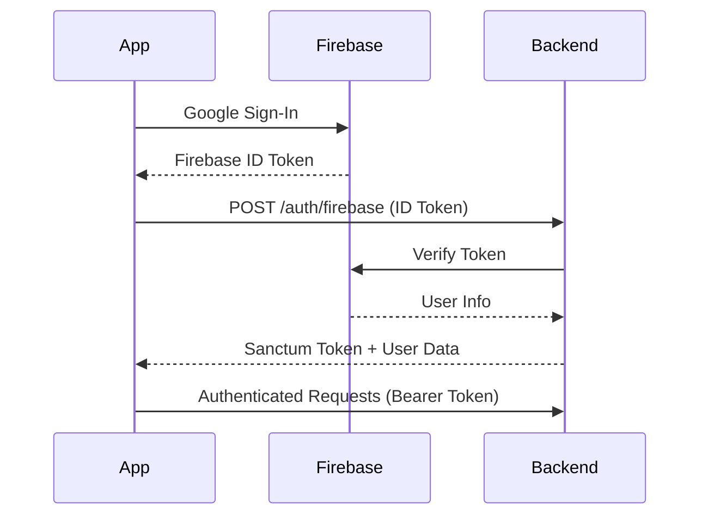

# Flutter Mobile Apps Implementation Guide - Anjem Ride-sharing Platform

## Document Status
**Created**: October 1, 2025
**Last Updated**: November 30, 2025
**Version**: 2.0
**Status**: Backend 100% Complete - Phase 9 In Progress (Critical Mobile Features)

---

## Executive Summary

This document provides comprehensive guidance for implementing the Flutter mobile applications (Rider & Driver) for the Anjem campus ride-sharing platform. The Laravel backend is **100% complete** (all schema issues resolved, 92% tests passing) with all critical functionality operational. Mobile implementation is now in **Phase 9** - completing critical features for MVP.

### Current State (Updated Nov 30, 2025)
- **Backend**: ✅ **100% COMPLETE** - All schema issues resolved, production-ready
- **Mobile**: 🔄 Phase 9 In Progress - 75% complete, 3 critical features remaining
- **Platform Focus**: 🤖 **Android-Only for MVP** (iOS post-MVP)
- **Time to Beta**: 8-12 days remaining
- **Critical Path**: Background location, WebSocket testing, call driver button

### ⚠️ Important: Android-First Strategy
**Decision**: iOS development is deferred until post-MVP to accelerate time to market. All implementation phases focus exclusively on Android. This reduces complexity and testing surface area by 50%, allowing faster iteration and deployment.

---

## Table of Contents

1. [Project Context & Architecture](#project-context--architecture)
2. [Backend API Integration Points](#backend-api-integration-points)
3. [Implementation Phases](#implementation-phases)
4. [Technical Specifications](#technical-specifications)
5. [Testing Strategy](#testing-strategy)
6. [Deployment Checklist](#deployment-checklist)

---

## Project Context & Architecture

### Technology Stack

**Mobile (Flutter)**
- Flutter SDK 3.5.4+
- Dart 3.5.4+
- **Platform**: Android Only (MVP) - iOS deferred to post-MVP
- Product Flavors: `rider` and `driver`
- State Management: Riverpod 2.5.1
- HTTP Client: Dio 5.7.0
- Maps: Mapbox Maps SDK for Flutter
- Real-time: Laravel Echo + socket_io_client
- Push Notifications: Firebase Cloud Messaging

**Backend (Laravel)** - ✅ **100% COMPLETE**
- Laravel 11.x with PostgreSQL 15 + PostGIS 3.6
- Real-time: Laravel Reverb (WebSocket)
- Authentication: Firebase Auth + Laravel Sanctum
- Maps & Routing: Mapbox Platform (80-90% cost savings via caching)
- Admin: 14 REST endpoints with role-based access
- Queue: Redis
- Push Notifications: Firebase Cloud Messaging

### Product Flavors Architecture

```
mobile/
├── lib/
│   ├── main_rider.dart          # Rider app entry point
│   ├── main_driver.dart         # Driver app entry point
│   ├── core/                    # Shared code (80% reusable)
│   │   ├── config/
│   │   ├── models/
│   │   ├── services/
│   │   ├── providers/
│   │   └── widgets/
│   ├── rider/                   # Rider-specific features
│   │   ├── screens/
│   │   ├── widgets/
│   │   └── providers/
│   └── driver/                  # Driver-specific features
│       ├── screens/
│       ├── widgets/
│       └── providers/
└── android/
    └── app/src/
        ├── rider/               # Rider flavor config
        └── driver/              # Driver flavor config
```

**Design Principles:**
- **DRY (Don't Repeat Yourself)**: Shared logic in `core/`
- **Flavor Separation**: UI/UX differences in `rider/` and `driver/`
- **Single Codebase**: Both apps built from one repository
- **Build Commands**:
  - Rider: `flutter run --flavor rider`
  - Driver: `flutter run --flavor driver`

---

## Backend API Integration Points

### Base URLs (Environment-dependent)
```dart
// Development
const API_BASE_URL = 'http://localhost:8000/api/v1';
const WS_URL = 'ws://localhost:6001';

// Production
const API_BASE_URL = 'https://api.anjem.app/v1';
const WS_URL = 'wss://api.anjem.app';
```

### Authentication Flow

**Firebase + Sanctum Hybrid Authentication**



**Implementation Pattern:**
```dart
// 1. Firebase Sign-In
final credential = await GoogleSignIn().signIn();
final idToken = await credential.authentication.idToken;

// 2. Exchange for Sanctum Token
final response = await dio.post('/auth/firebase', data: {
  'firebase_token': idToken,
  'device_name': 'Flutter App'
});

// 3. Store Sanctum Token
await secureStorage.write(key: 'sanctum_token', value: response.data['token']);
```

### API Endpoints Reference

#### Authentication Endpoints
| Method | Endpoint | Description | Auth Required |
|--------|----------|-------------|---------------|
| POST | `/auth/firebase` | Authenticate with Firebase token | No |
| GET | `/auth/google` | Google OAuth redirect | No |
| POST | `/auth/refresh` | Refresh Sanctum token | Yes |
| POST | `/auth/logout` | Logout and invalidate token | Yes |
| POST | `/auth/fcm-token` | Update FCM token for push notifications | Yes |

#### User Profile
| Method | Endpoint | Description |
|--------|----------|-------------|
| GET | `/user` | Get authenticated user profile with driver profile |

#### Rider Endpoints (Ride Requests)
| Method | Endpoint | Description |
|--------|----------|-------------|
| GET | `/requests/estimates` | Get fare estimates for a route |
| POST | `/requests` | Create new ride request |
| GET | `/requests/{id}` | Get ride request details |
| PATCH | `/requests/{id}/cancel` | Cancel pending ride request |
| GET | `/requests` | List user's ride requests |

#### Driver Endpoints
| Method | Endpoint | Description |
|--------|----------|-------------|
| POST | `/driver/online` | Go online at a beacon location |
| POST | `/driver/offline` | Go offline |
| GET | `/driver/queue` | Get current queue position |
| POST | `/driver/location` | Update driver location (10s interval) |
| GET | `/driver/beacons` | Get available beacon locations |
| GET | `/driver/statistics` | Get earnings and session statistics |

#### Ride Management
| Method | Endpoint | Description |
|--------|----------|-------------|
| POST | `/rides/{request}/accept` | Accept a ride request |
| PATCH | `/rides/{id}/status` | Update ride status |
| POST | `/rides/{id}/rate` | Rate completed ride |
| GET | `/rides/{id}` | Get ride details |
| GET | `/rides` | List rides (filtered by status) |

#### Locations/Beacons
| Method | Endpoint | Description |
|--------|----------|-------------|
| GET | `/locations` | Get all active beacon locations |

### WebSocket Events (Laravel Reverb)

**Connection Setup:**
```dart
import 'package:laravel_echo/laravel_echo.dart';

final echo = Echo({
  'broadcaster': 'reverb',
  'host': 'localhost:6001',
  'authEndpoint': 'http://localhost:8000/api/broadcasting/auth',
  'auth': {
    'headers': {
      'Authorization': 'Bearer $sanctumToken',
    }
  }
});
```

**Event Subscriptions:**

| Channel | Event | Data | Used By |
|---------|-------|------|---------|
| `private-ride.{rideId}` | `RideStatusUpdated` | `{ride_id, status, updated_at}` | Rider & Driver |
| `private-ride.{rideId}` | `DriverLocationUpdated` | `{ride_id, latitude, longitude}` | Rider |
| `private-user.{userId}` | `RideRequestMatched` | `{ride_id, driver_id, estimated_arrival}` | Rider |
| `private-driver.{driverId}` | `NewRideRequest` | `{request_id, pickup, destination, fare}` | Driver |
| `presence-beacon.{beaconId}` | `QueuePositionChanged` | `{driver_id, position, estimated_wait}` | Driver |

**Implementation Example:**
```dart
// Subscribe to ride updates
echo.private('ride.$rideId')
  .listen('RideStatusUpdated', (event) {
    ref.read(rideProvider.notifier).updateStatus(event.status);
  });

// Subscribe to driver location
echo.private('ride.$rideId')
  .listen('DriverLocationUpdated', (event) {
    ref.read(mapProvider.notifier).updateDriverLocation(
      LatLng(event.latitude, event.longitude)
    );
  });
```

### API Response Format

**Success Response:**
```json
{
  "success": true,
  "data": { /* resource data */ },
  "message": "Optional success message"
}
```

**Error Response:**
```json
{
  "success": false,
  "message": "Error message",
  "errors": {
    "field": ["Validation error"]
  }
}
```

**Pagination:**
```json
{
  "success": true,
  "data": [ /* items */ ],
  "meta": {
    "current_page": 1,
    "last_page": 10,
    "per_page": 15,
    "total": 150
  }
}
```

---

## Implementation Phases

### Phase 1: Core Setup & Authentication + Driver KYC (8 hours) - ✅ COMPLETED

**Objective:** Establish foundation with working authentication and driver verification

#### 1.1 Project Structure Setup (1 hour) - ✅ COMPLETED
- [x] Flutter project initialized ✅
- [x] Product flavors configured ✅
- [x] Directory structure created in `lib/` ✅
- [x] Dependencies added to `pubspec.yaml` ✅
- [x] Firebase configured for both flavors ✅

**Files to Create:**
```
lib/core/
├── config/
│   ├── environment.dart         # API URLs, keys
│   └── theme_config.dart        # App theming
├── models/
│   ├── user.dart
│   ├── driver_profile.dart
│   ├── kyc_submission.dart      # ✅ IMPLEMENTED
│   ├── location.dart
│   ├── ride_request.dart
│   └── ride.dart
├── services/
│   ├── api_service.dart         # Dio HTTP client ✅
│   ├── auth_service.dart        # Firebase + Sanctum ✅
│   ├── kyc/
│   │   └── kyc_service.dart     # ✅ IMPLEMENTED
│   ├── websocket_service.dart   # Reverb connection
│   └── location_service.dart    # GPS services
├── providers/
│   ├── auth_provider.dart       # ✅ IMPLEMENTED
│   ├── kyc_provider.dart        # ✅ IMPLEMENTED
│   └── user_provider.dart
└── widgets/
    ├── loading_indicator.dart
    └── error_view.dart

lib/driver/
├── screens/
│   ├── kyc_form_screen.dart         # ✅ IMPLEMENTED
│   └── email_verification_screen.dart  # ✅ IMPLEMENTED
```

#### 1.2 Authentication Implementation (4 hours) - ✅ COMPLETED

**AuthService Requirements:**
- Google Sign-In with Firebase
- Exchange Firebase token for Sanctum token
- Secure token storage (`flutter_secure_storage`)
- Auto-refresh expired tokens
- Token validation and error handling

**Code Skeleton:**
```dart
class AuthService {
  final Dio _dio;
  final FirebaseAuth _firebaseAuth;
  final GoogleSignIn _googleSignIn;
  final FlutterSecureStorage _storage;

  // Sign in with Google
  Future<User?> signInWithGoogle() async {
    // 1. Firebase Google Sign-In
    // 2. Get ID token
    // 3. Exchange for Sanctum token via /auth/firebase
    // 4. Store token securely
    // 5. Return User model
  }

  // Check if user is authenticated
  Future<bool> isAuthenticated() async {
    final token = await _storage.read(key: 'sanctum_token');
    return token != null && !_isTokenExpired(token);
  }

  // Refresh token
  Future<void> refreshToken() async {
    // Call /auth/refresh
  }

  // Logout
  Future<void> logout() async {
    // Call /auth/logout
    // Clear local storage
    // Sign out from Firebase
  }
}
```

#### 1.3 API Service Setup (2 hours) - ✅ COMPLETED

**ApiService with Dio Interceptors:**
```dart
class ApiService {
  late Dio _dio;
  final FlutterSecureStorage _storage;

  ApiService(this._storage) {
    _dio = Dio(BaseOptions(
      baseUrl: AppConfig.instance.apiBaseUrl,
      connectTimeout: Duration(seconds: 30),
      receiveTimeout: Duration(seconds: 30),
    ));

    // Request interceptor - Add auth token
    _dio.interceptors.add(InterceptorsWrapper(
      onRequest: (options, handler) async {
        final token = await _storage.read(key: 'sanctum_token');
        if (token != null) {
          options.headers['Authorization'] = 'Bearer $token';
        }
        return handler.next(options);
      },

      // Response interceptor - Handle errors
      onError: (error, handler) async {
        if (error.response?.statusCode == 401) {
          // Token expired, try refresh
          final refreshed = await _refreshToken();
          if (refreshed) {
            // Retry original request
            return handler.resolve(await _dio.fetch(error.requestOptions));
          }
        }
        return handler.next(error);
      },
    ));
  }

  Future<Response> get(String path, {Map<String, dynamic>? params}) =>
      _dio.get(path, queryParameters: params);

  Future<Response> post(String path, {dynamic data}) =>
      _dio.post(path, data: data);
}
```

#### 1.4 Testing Authentication (1 hour) - ✅ COMPLETED
- Test Google Sign-In flow
- Verify Sanctum token storage
- Test token refresh
- Test logout functionality
- Handle offline scenarios

#### 1.5 Driver KYC Verification (Bonus) - ✅ COMPLETED
- 3-page KYC form (student info, vehicle info, KTM photo upload)
- Email verification screen with 6-digit OTP input
- Domain validation (@students.undip.ac.id)
- KYC status check and auto-verification flow

**Deliverables:**
- ✅ Users can sign in with Google
- ✅ Sanctum token stored securely and persists across app restarts
- ✅ Auto-refresh on token expiration
- ✅ Error handling for network issues
- ✅ Driver KYC verification with email validation

---

### Phase 2: Rider App Core Flow (10 hours)

**Objective:** Complete rider journey from request to rating

#### 2.1 Map Integration (3 hours)

**HomeScreen - Map with Beacons**
```dart
class RiderHomeScreen extends ConsumerStatefulWidget {
  @override
  _RiderHomeScreenState createState() => _RiderHomeScreenState();
}

class _RiderHomeScreenState extends ConsumerState<RiderHomeScreen> {
  GoogleMapController? _mapController;

  @override
  Widget build(BuildContext context) {
    final beacons = ref.watch(beaconsProvider);
    final userLocation = ref.watch(userLocationProvider);

    return Scaffold(
      body: GoogleMap(
        initialCameraPosition: CameraPosition(
          target: userLocation ?? LatLng(-6.3615, 106.8242), // UI Campus
          zoom: 15,
        ),
        markers: _buildBeaconMarkers(beacons),
        myLocationEnabled: true,
        onMapCreated: (controller) => _mapController = controller,
      ),
      floatingActionButton: FloatingActionButton.extended(
        onPressed: () => _showLocationPicker(),
        label: Text('Request Ride'),
        icon: Icon(Icons.car_rental),
      ),
    );
  }
}
```

**Requirements:**
- Display user's current location
- Show all active beacon locations as markers
- Custom marker icons for beacons
- Camera animation to user location
- Handle location permissions
- Offline map caching (optional)

#### 2.2 Ride Request Flow (4 hours)

**Screens to Implement:**

1. **LocationSelectionScreen**
   - Search/select pickup beacon
   - Search/select destination beacon
   - Show estimated distance/time
   - Calculate fare estimate via `/requests/estimates`

2. **RideDetailsScreen**
   - Passenger count selector (1-4)
   - Special requests text field
   - Fare estimate display
   - Confirm button → POST `/requests`

3. **WaitingScreen**
   - Real-time queue position updates
   - Estimated wait time
   - Cancel button → PATCH `/requests/{id}/cancel`
   - WebSocket: Listen for `RideRequestMatched` event

4. **DriverMatchedScreen**
   - Driver info (name, photo, rating)
   - Vehicle details (make, model, plate)
   - ETA to pickup location
   - Call driver button

**State Management:**
```dart
@riverpod
class RideRequest extends _$RideRequest {
  @override
  RideRequestState build() => RideRequestState.initial();

  Future<void> createRequest({
    required Location pickup,
    required Location destination,
    required int passengerCount,
    String? specialRequests,
  }) async {
    state = RideRequestState.loading();

    try {
      final response = await ref.read(apiServiceProvider).post('/requests', data: {
        'pickup_beacon_id': pickup.id,
        'destination_beacon_id': destination.id,
        'passenger_count': passengerCount,
        'special_requests': specialRequests,
      });

      final request = RideRequest.fromJson(response.data['data']);
      state = RideRequestState.success(request);

      // Subscribe to WebSocket for matching updates
      _subscribeToMatching(request.id);
    } catch (e) {
      state = RideRequestState.error(e.toString());
    }
  }

  void _subscribeToMatching(int requestId) {
    ref.read(websocketServiceProvider).subscribeToUserChannel(
      userId: ref.read(authProvider).user!.id,
      onRideMatched: (rideData) {
        state = RideRequestState.matched(Ride.fromJson(rideData));
      },
    );
  }
}
```

#### 2.3 Active Ride Tracking (2 hours)

**TrackingScreen**
- Map with driver's live location
- Polyline showing route
- Driver ETA updates
- Ride status updates via WebSocket
- Complete ride automatically when driver marks it

**WebSocket Integration:**
```dart
void _subscribeToRideUpdates(int rideId) {
  final ws = ref.read(websocketServiceProvider);

  // Listen to driver location updates (every 10s)
  ws.subscribeToRideChannel(
    rideId: rideId,
    onLocationUpdate: (lat, lng) {
      ref.read(driverLocationProvider.notifier).update(LatLng(lat, lng));
      _updateETA(lat, lng);
    },
    onStatusUpdate: (status) {
      if (status == 'completed') {
        _navigateToRating();
      }
    },
  );
}
```

#### 2.4 Rating & History (1 hour)

**CompletedScreen**
- Fare summary
- Star rating (1-5)
- Predefined tags (Clean, Safe Driving, Friendly, etc.)
- Submit → POST `/rides/{id}/rate`

**Ride History**
- List of past rides
- Filter by status
- Pagination support

**Deliverables:**
- ✅ Riders can browse beacon locations
- ✅ Complete ride request with all details
- ✅ Real-time queue position updates
- ✅ Live driver tracking during ride
- ✅ Rate driver after completion

---

### Phase 3: Driver App Core Flow (10 hours)

**Objective:** Driver operations from going online to completing rides

#### 3.1 Driver Home & Queue Management (3 hours)

**DriverHomeScreen**
```dart
class DriverHomeScreen extends ConsumerWidget {
  @override
  Widget build(BuildContext context, WidgetRef ref) {
    final driverStatus = ref.watch(driverStatusProvider);
    final statistics = ref.watch(driverStatisticsProvider);

    return Scaffold(
      appBar: AppBar(
        title: Text('Anjem Driver'),
        actions: [
          // Online/Offline Toggle
          Switch(
            value: driverStatus.isOnline,
            onChanged: (value) {
              if (value) {
                _showBeaconSelection();
              } else {
                ref.read(driverStatusProvider.notifier).goOffline();
              }
            },
          ),
        ],
      ),
      body: Column(
        children: [
          // Earnings Summary Card
          EarningsSummaryCard(
            todayEarnings: statistics.todayEarnings,
            weekEarnings: statistics.weekEarnings,
            totalRides: statistics.todayRides,
          ),

          // Current Status
          if (driverStatus.isOnline) ...[
            if (driverStatus.isInQueue)
              QueuePositionCard(
                position: driverStatus.queuePosition,
                estimatedWait: driverStatus.estimatedWait,
              )
            else if (driverStatus.hasActiveRide)
              ActiveRideCard(ride: driverStatus.activeRide)
          ] else
            OfflinePromptCard(),
        ],
      ),
    );
  }
}
```

**BeaconSelectionScreen**
- Map showing available beacons
- Queue size at each beacon
- Select beacon → POST `/driver/online`

**QueueScreen**
- Current position in queue
- Estimated wait time for next ride
- Number of drivers ahead
- Leave queue button

#### 3.2 Ride Request Handling (3 hours)

**RideRequestScreen**
- Push notification when matched
- Display ride details (pickup, destination, fare)
- 30-second countdown timer to accept/decline
- Accept → POST `/rides/{request}/accept`
- Decline → Auto-assign to next driver

**Implementation:**
```dart
@riverpod
class DriverRideRequest extends _$DriverRideRequest {
  Timer? _countdownTimer;

  void onNewRequest(RideRequest request) {
    state = DriverRideRequestState.pending(request);

    // Start 30-second countdown
    _countdownTimer = Timer(Duration(seconds: 30), () {
      if (state is Pending) {
        _autoDecline();
      }
    });
  }

  Future<void> acceptRequest(int requestId) async {
    _countdownTimer?.cancel();
    state = DriverRideRequestState.loading();

    try {
      final response = await ref.read(apiServiceProvider).post(
        '/rides/$requestId/accept'
      );

      final ride = Ride.fromJson(response.data['data']);
      state = DriverRideRequestState.accepted(ride);

      // Navigate to navigation screen
      ref.read(routerProvider).push('/driver/navigation/${ride.id}');
    } catch (e) {
      state = DriverRideRequestState.error(e.toString());
    }
  }
}
```

#### 3.3 Navigation & Active Ride (3 hours)

**NavigationScreen (To Pickup)**
- Google Maps with turn-by-turn navigation
- Polyline route to pickup location
- ETA display
- "Arrived" button when within 50m of pickup
- Update status → PATCH `/rides/{id}/status` (status: 'arrived')

**ActiveRideScreen (During Ride)**
- Rider info (name, photo, rating)
- Destination displayed
- Route polyline
- "Complete Ride" button at destination
- Update status → PATCH `/rides/{id}/status` (status: 'completed')

**Background Location Updates:**
```dart
class DriverLocationService {
  Timer? _locationTimer;

  void startLocationUpdates() {
    _locationTimer = Timer.periodic(Duration(seconds: 10), (timer) async {
      final position = await Geolocator.getCurrentPosition();

      await ref.read(apiServiceProvider).post('/driver/location', data: {
        'latitude': position.latitude,
        'longitude': position.longitude,
      });
    });
  }

  void stopLocationUpdates() {
    _locationTimer?.cancel();
  }
}
```

#### 3.4 Earnings & Statistics (1 hour)

**EarningsScreen**
- Today's earnings and rides
- Weekly summary
- Session statistics
- Ride history
- Fetch via `/driver/statistics`

**Deliverables:**
- ✅ Drivers can go online at beacon locations
- ✅ Queue management with position tracking
- ✅ Accept/decline ride requests
- ✅ Navigation to pickup and destination
- ✅ Background location updates every 10s
- ✅ Complete rides and view earnings

---

### Phase 4: Maps & Navigation (8 hours)

**Objective:** Professional map integration with routing

#### 4.1 Google Maps Setup (2 hours)

**Configuration:**
- Add Google Maps API key to `android/app/src/main/AndroidManifest.xml`
- Enable Maps SDK for Android/iOS
- Enable Directions API
- Configure API restrictions

**Custom Map Styling:**
```dart
class MapTheme {
  static const String riderMapStyle = '''
  [
    {
      "featureType": "poi",
      "stylers": [{"visibility": "off"}]
    }
  ]
  ''';

  static const String driverMapStyle = '''
  [
    {
      "featureType": "road",
      "elementType": "geometry",
      "stylers": [{"color": "#4CAF50"}]
    }
  ]
  ''';
}
```

#### 4.2 Custom Markers & Overlays (2 hours)

**Beacon Markers:**
```dart
BitmapDescriptor _createBeaconMarker(int queueSize) {
  // Custom marker with queue count badge
  return BitmapDescriptor.fromAssetImage(
    ImageConfiguration(size: Size(48, 48)),
    'assets/markers/beacon_marker.png',
  );
}
```

**Driver Car Marker:**
- Animated car icon
- Rotation based on bearing
- Smooth movement between locations

**Marker Clustering:**
- Cluster nearby beacons at low zoom levels
- Expand on zoom in

#### 4.3 Route Polylines (2 hours)

**Google Directions API Integration:**
```dart
class DirectionsService {
  Future<List<LatLng>> getRoute({
    required LatLng origin,
    required LatLng destination,
  }) async {
    final response = await dio.get(
      'https://maps.googleapis.com/maps/api/directions/json',
      queryParameters: {
        'origin': '${origin.latitude},${origin.longitude}',
        'destination': '${destination.latitude},${destination.longitude}',
        'key': AppConfig.googleMapsApiKey,
        'mode': 'driving',
      },
    );

    final points = response.data['routes'][0]['overview_polyline']['points'];
    return _decodePolyline(points);
  }

  List<LatLng> _decodePolyline(String encoded) {
    // Decode Google's polyline encoding
  }
}
```

**Polyline Display:**
```dart
Polyline _buildRoutePolyline(List<LatLng> points) {
  return Polyline(
    polylineId: PolylineId('route'),
    points: points,
    color: AppConfig.instance.primaryColor,
    width: 5,
    patterns: [PatternItem.dash(30), PatternItem.gap(20)],
  );
}
```

#### 4.4 Geofencing & Location Accuracy (2 hours)

**Beacon Proximity Detection:**
```dart
bool isNearBeacon(LatLng userLocation, LatLng beaconLocation) {
  final distance = Geolocator.distanceBetween(
    userLocation.latitude,
    userLocation.longitude,
    beaconLocation.latitude,
    beaconLocation.longitude,
  );

  return distance <= 50; // 50 meters threshold
}
```

**Location Accuracy Settings:**
```dart
LocationSettings get platformLocationSettings {
  if (Platform.isAndroid) {
    return AndroidSettings(
      accuracy: LocationAccuracy.high,
      distanceFilter: 10, // Update every 10 meters
      intervalDuration: Duration(seconds: 10),
    );
  } else {
    return AppleSettings(
      accuracy: LocationAccuracy.high,
      distanceFilter: 10,
    );
  }
}
```

**Deliverables:**
- ✅ Professional map styling for both apps
- ✅ Custom markers with proper icons
- ✅ Smooth route polylines
- ✅ Accurate location tracking
- ✅ Geofencing for beacon proximity

---

### Phase 5: Real-time WebSocket Integration (8 hours)

**Objective:** Connect to Laravel Reverb for live updates

#### 5.1 WebSocket Service Setup (3 hours)

**Dependencies:**
```yaml
dependencies:
  laravel_echo: ^0.4.0
  pusher_channels_flutter: ^2.2.1
  web_socket_channel: ^3.0.1
```

**WebSocketService Implementation:**
```dart
class WebSocketService {
  late Echo echo;
  late PusherChannelsFlutter pusher;
  final String wsUrl;
  final AuthService authService;

  WebSocketService({required this.wsUrl, required this.authService});

  Future<void> connect() async {
    final token = await authService.getToken();

    pusher = PusherChannelsFlutter.getInstance();
    await pusher.init(
      apiKey: AppConfig.pusherKey,
      cluster: AppConfig.pusherCluster,
      onConnectionStateChange: _onConnectionStateChange,
      onError: _onError,
      onAuthorizer: (channelName, socketId) async {
        // Custom authorization
        final response = await dio.post(
          '$wsUrl/api/broadcasting/auth',
          data: {
            'socket_id': socketId,
            'channel_name': channelName,
          },
          options: Options(headers: {
            'Authorization': 'Bearer $token',
          }),
        );
        return response.data;
      },
    );

    await pusher.connect();
  }

  void subscribeToRideChannel({
    required int rideId,
    required Function(Map<String, dynamic>) onStatusUpdate,
    required Function(double, double) onLocationUpdate,
  }) {
    final channel = pusher.subscribe(
      channelName: 'private-ride.$rideId',
    );

    channel.bind('RideStatusUpdated', (event) {
      onStatusUpdate(json.decode(event.data));
    });

    channel.bind('DriverLocationUpdated', (event) {
      final data = json.decode(event.data);
      onLocationUpdate(data['latitude'], data['longitude']);
    });
  }

  void disconnect() {
    pusher.disconnect();
  }
}
```

#### 5.2 Event Handling (3 hours)

**Rider Events:**
```dart
class RiderWebSocketHandler {
  void setupListeners(int userId, int? currentRideId) {
    // User-specific events
    _subscribeToUserChannel(userId);

    // Ride-specific events
    if (currentRideId != null) {
      _subscribeToRideChannel(currentRideId);
    }
  }

  void _subscribeToUserChannel(int userId) {
    ws.subscribeToChannel(
      channelName: 'private-user.$userId',
      events: {
        'RideRequestMatched': (data) {
          // Navigate to DriverMatchedScreen
          ref.read(rideProvider.notifier).setMatchedDriver(data);
        },
      },
    );
  }

  void _subscribeToRideChannel(int rideId) {
    ws.subscribeToChannel(
      channelName: 'private-ride.$rideId',
      events: {
        'DriverLocationUpdated': (data) {
          // Update map marker
          ref.read(driverLocationProvider.notifier).update(data);
        },
        'RideStatusUpdated': (data) {
          // Update UI based on status
          ref.read(rideProvider.notifier).updateStatus(data['status']);
        },
      },
    );
  }
}
```

**Driver Events:**
```dart
class DriverWebSocketHandler {
  void setupListeners(int driverId, int? beaconId) {
    _subscribeToDriverChannel(driverId);

    if (beaconId != null) {
      _subscribeToBeaconChannel(beaconId);
    }
  }

  void _subscribeToDriverChannel(int driverId) {
    ws.subscribeToChannel(
      channelName: 'private-driver.$driverId',
      events: {
        'NewRideRequest': (data) {
          // Show RideRequestScreen with 30s timer
          ref.read(driverRideRequestProvider.notifier).onNewRequest(data);
        },
      },
    );
  }

  void _subscribeToBeaconChannel(int beaconId) {
    ws.subscribeToChannel(
      channelName: 'presence-beacon.$beaconId',
      events: {
        'QueuePositionChanged': (data) {
          // Update queue position
          ref.read(queueProvider.notifier).updatePosition(data);
        },
      },
    );
  }
}
```

#### 5.3 Connection Management (2 hours)

**Auto-reconnection:**
```dart
class WebSocketManager {
  Timer? _reconnectTimer;
  int _reconnectAttempts = 0;

  void _onConnectionStateChange(String currentState, String? previousState) {
    if (currentState == 'DISCONNECTED') {
      _scheduleReconnect();
    } else if (currentState == 'CONNECTED') {
      _reconnectAttempts = 0;
      _resubscribeToChannels();
    }
  }

  void _scheduleReconnect() {
    final delay = Duration(seconds: min(30, pow(2, _reconnectAttempts) as int));

    _reconnectTimer = Timer(delay, () {
      _reconnectAttempts++;
      pusher.connect();
    });
  }

  void _resubscribeToChannels() {
    // Re-subscribe to all active channels
    final activeChannels = ref.read(activeChannelsProvider);
    for (final channel in activeChannels) {
      pusher.subscribe(channelName: channel);
    }
  }
}
```

**Message Queuing for Offline:**
```dart
class OfflineMessageQueue {
  final List<PendingMessage> _queue = [];

  void queueMessage(String channel, String event, Map<String, dynamic> data) {
    _queue.add(PendingMessage(
      channel: channel,
      event: event,
      data: data,
      timestamp: DateTime.now(),
    ));
  }

  Future<void> flushQueue() async {
    for (final message in _queue) {
      await _sendMessage(message);
    }
    _queue.clear();
  }
}
```

**Deliverables:**
- ✅ WebSocket connection with auto-reconnect
- ✅ All events properly handled
- ✅ Offline message queuing
- ✅ Battery-efficient implementation

---

### Phase 6: UI/UX Polish (8 hours)

**Objective:** Production-ready user interface

#### 6.1 Design System (3 hours)

**Theme Configuration:**
```dart
class AppTheme {
  static ThemeData riderTheme = ThemeData(
    useMaterial3: true,
    colorScheme: ColorScheme.fromSeed(
      seedColor: Color(0xFF2196F3), // Blue
      brightness: Brightness.light,
    ),
    appBarTheme: AppBarTheme(
      elevation: 0,
      centerTitle: true,
    ),
    elevatedButtonTheme: ElevatedButtonThemeData(
      style: ElevatedButton.styleFrom(
        minimumSize: Size.fromHeight(50),
        shape: RoundedRectangleBorder(
          borderRadius: BorderRadius.circular(12),
        ),
      ),
    ),
  );

  static ThemeData driverTheme = ThemeData(
    useMaterial3: true,
    colorScheme: ColorScheme.fromSeed(
      seedColor: Color(0xFF4CAF50), // Green
      brightness: Brightness.light,
    ),
    // Same structure as rider
  );
}
```

**Typography:**
```dart
class AppTextStyles {
  static const TextStyle h1 = TextStyle(
    fontSize: 32,
    fontWeight: FontWeight.bold,
    height: 1.2,
  );

  static const TextStyle h2 = TextStyle(
    fontSize: 24,
    fontWeight: FontWeight.w600,
    height: 1.3,
  );

  static const TextStyle body = TextStyle(
    fontSize: 16,
    fontWeight: FontWeight.normal,
    height: 1.5,
  );

  static const TextStyle caption = TextStyle(
    fontSize: 14,
    fontWeight: FontWeight.w400,
    color: Colors.grey,
  );
}
```

**Spacing System:**
```dart
class AppSpacing {
  static const double xs = 4.0;
  static const double sm = 8.0;
  static const double md = 16.0;
  static const double lg = 24.0;
  static const double xl = 32.0;
}
```

#### 6.2 Shared Components (3 hours)

**Loading States:**
```dart
class LoadingIndicator extends StatelessWidget {
  final String? message;

  @override
  Widget build(BuildContext context) {
    return Center(
      child: Column(
        mainAxisSize: MainAxisSize.min,
        children: [
          CircularProgressIndicator(),
          if (message != null) ...[
            SizedBox(height: AppSpacing.md),
            Text(message!, style: AppTextStyles.body),
          ],
        ],
      ),
    );
  }
}
```

**Error States:**
```dart
class ErrorView extends StatelessWidget {
  final String message;
  final VoidCallback? onRetry;

  @override
  Widget build(BuildContext context) {
    return Center(
      child: Padding(
        padding: EdgeInsets.all(AppSpacing.lg),
        child: Column(
          mainAxisSize: MainAxisSize.min,
          children: [
            Icon(Icons.error_outline, size: 64, color: Colors.red),
            SizedBox(height: AppSpacing.md),
            Text(message, textAlign: TextAlign.center),
            if (onRetry != null) ...[
              SizedBox(height: AppSpacing.lg),
              ElevatedButton(
                onPressed: onRetry,
                child: Text('Retry'),
              ),
            ],
          ],
        ),
      ),
    );
  }
}
```

**Empty States:**
```dart
class EmptyState extends StatelessWidget {
  final String title;
  final String subtitle;
  final IconData icon;
  final VoidCallback? action;
  final String? actionLabel;

  @override
  Widget build(BuildContext context) {
    return Center(
      child: Padding(
        padding: EdgeInsets.all(AppSpacing.xl),
        child: Column(
          mainAxisSize: MainAxisSize.min,
          children: [
            Icon(icon, size: 80, color: Colors.grey[400]),
            SizedBox(height: AppSpacing.lg),
            Text(title, style: AppTextStyles.h2),
            SizedBox(height: AppSpacing.sm),
            Text(
              subtitle,
              style: AppTextStyles.caption,
              textAlign: TextAlign.center,
            ),
            if (action != null && actionLabel != null) ...[
              SizedBox(height: AppSpacing.xl),
              ElevatedButton(
                onPressed: action,
                child: Text(actionLabel),
              ),
            ],
          ],
        ),
      ),
    );
  }
}
```

#### 6.3 Animations & Transitions (2 hours)

**Page Transitions:**
```dart
class SlidePageRoute extends PageRouteBuilder {
  final Widget page;

  SlidePageRoute({required this.page})
      : super(
          pageBuilder: (context, animation, secondaryAnimation) => page,
          transitionsBuilder: (context, animation, secondaryAnimation, child) {
            const begin = Offset(1.0, 0.0);
            const end = Offset.zero;
            const curve = Curves.easeInOut;

            var tween = Tween(begin: begin, end: end).chain(
              CurveTween(curve: curve),
            );

            return SlideTransition(
              position: animation.drive(tween),
              child: child,
            );
          },
        );
}
```

**Loading Skeleton:**
```dart
class SkeletonLoader extends StatelessWidget {
  @override
  Widget build(BuildContext context) {
    return Shimmer.fromColors(
      baseColor: Colors.grey[300]!,
      highlightColor: Colors.grey[100]!,
      child: Column(
        children: List.generate(5, (index) => _buildSkeletonItem()),
      ),
    );
  }

  Widget _buildSkeletonItem() {
    return Container(
      margin: EdgeInsets.all(AppSpacing.sm),
      decoration: BoxDecoration(
        color: Colors.white,
        borderRadius: BorderRadius.circular(8),
      ),
      height: 80,
    );
  }
}
```

**Deliverables:**
- ✅ Consistent design system across both apps
- ✅ Reusable UI components
- ✅ Smooth animations and transitions
- ✅ Loading, error, and empty states
- ✅ Accessibility support (screen readers, contrast)

---

### Phase 7: Testing & Deployment (8 hours)

**Objective:** Production-ready builds with comprehensive testing

#### 7.1 Unit Testing (3 hours)

**Service Tests:**
```dart
void main() {
  group('AuthService', () {
    late AuthService authService;
    late MockFirebaseAuth mockFirebaseAuth;
    late MockDio mockDio;

    setUp(() {
      mockFirebaseAuth = MockFirebaseAuth();
      mockDio = MockDio();
      authService = AuthService(
        firebaseAuth: mockFirebaseAuth,
        dio: mockDio,
      );
    });

    test('signInWithGoogle returns user on success', () async {
      // Arrange
      when(mockFirebaseAuth.signInWithCredential(any))
          .thenAnswer((_) async => MockUserCredential());

      when(mockDio.post('/auth/firebase', data: anyNamed('data')))
          .thenAnswer((_) async => Response(
                data: {'success': true, 'token': 'test_token'},
                statusCode: 200,
              ));

      // Act
      final result = await authService.signInWithGoogle();

      // Assert
      expect(result, isNotNull);
      expect(result.token, equals('test_token'));
    });
  });
}
```

**Provider Tests:**
```dart
void main() {
  group('RideRequestProvider', () {
    late ProviderContainer container;

    setUp(() {
      container = ProviderContainer(
        overrides: [
          apiServiceProvider.overrideWithValue(MockApiService()),
        ],
      );
    });

    tearDown(() {
      container.dispose();
    });

    test('createRequest updates state correctly', () async {
      // Test implementation
    });
  });
}
```

#### 7.2 Widget Testing (2 hours)

**Screen Tests:**
```dart
void main() {
  testWidgets('RiderHomeScreen displays map and request button',
      (tester) async {
    await tester.pumpWidget(
      ProviderScope(
        overrides: [
          beaconsProvider.overrideWith((ref) => mockBeacons),
        ],
        child: MaterialApp(home: RiderHomeScreen()),
      ),
    );

    expect(find.byType(GoogleMap), findsOneWidget);
    expect(find.text('Request Ride'), findsOneWidget);

    await tester.tap(find.text('Request Ride'));
    await tester.pumpAndSettle();

    expect(find.byType(LocationSelectionScreen), findsOneWidget);
  });
}
```

#### 7.3 Integration Testing (2 hours)

**End-to-End Test:**
```dart
void main() {
  IntegrationTestWidgetsFlutterBinding.ensureInitialized();

  testWidgets('Complete rider flow: request to completion', (tester) async {
    // 1. Launch app
    app.main();
    await tester.pumpAndSettle();

    // 2. Sign in
    await tester.tap(find.text('Sign in with Google'));
    await tester.pumpAndSettle(Duration(seconds: 3));

    // 3. Request ride
    await tester.tap(find.text('Request Ride'));
    await tester.pumpAndSettle();

    // 4. Select pickup beacon
    await tester.tap(find.text('Faculty of Engineering'));
    await tester.pumpAndSettle();

    // 5. Select destination
    await tester.tap(find.text('Student Center'));
    await tester.pumpAndSettle();

    // 6. Confirm request
    await tester.tap(find.text('Confirm Request'));
    await tester.pumpAndSettle();

    // Verify we're on waiting screen
    expect(find.text('Finding a driver...'), findsOneWidget);
  });
}
```

#### 7.4 Build & Release (1 hour)

**Build Commands:**
```bash
# Rider App
flutter build apk --flavor rider --release --obfuscate --split-debug-info=build/rider/debug-info

# Driver App
flutter build apk --flavor driver --release --obfuscate --split-debug-info=build/driver/debug-info

# App Bundle for Play Store
flutter build appbundle --flavor rider --release
flutter build appbundle --flavor driver --release
```

**Pre-release Checklist:**
- [ ] All tests passing
- [ ] Code obfuscation enabled
- [ ] ProGuard rules configured
- [ ] App signing configured
- [ ] Version code incremented
- [ ] Change log updated
- [ ] Privacy policy and terms updated
- [ ] Google Maps API key restrictions set

**Deliverables:**
- ✅ 80%+ test coverage
- ✅ All critical flows tested
- ✅ Release builds generated
- ✅ Ready for Play Store submission

---

## Technical Specifications

### Performance Requirements

| Metric | Target | Critical? |
|--------|--------|-----------|
| Cold Start Time | < 2.5s | Yes |
| APK Size (per flavor) | < 30MB | Yes |
| Memory Usage | < 150MB | No |
| Battery Drain (driver/hour) | < 3% | Yes |
| Frame Rate (scrolling) | 60 FPS | Yes |
| API Response Handling | < 500ms | No |

### Offline Support

**What Works Offline:**
- View past ride history (cached)
- View saved locations
- View profile information

**What Requires Connection:**
- Authentication
- Creating new ride requests
- Real-time location updates
- WebSocket events

**Implementation:**
```dart
class CacheService {
  final Hive _hive;

  Future<void> cacheRideHistory(List<Ride> rides) async {
    final box = await _hive.openBox('ride_history');
    await box.put('rides', rides.map((r) => r.toJson()).toList());
  }

  Future<List<Ride>> getCachedRideHistory() async {
    final box = await _hive.openBox('ride_history');
    final data = box.get('rides', defaultValue: []);
    return (data as List).map((json) => Ride.fromJson(json)).toList();
  }
}
```

### Security Considerations

**Token Storage:**
- Use `flutter_secure_storage` for Sanctum tokens
- Never log tokens
- Implement token rotation
- Clear tokens on logout

**API Communication:**
- Enforce HTTPS only
- Certificate pinning (optional but recommended)
- Request timeout limits
- Validate all responses

**Data Privacy:**
- Request minimal permissions
- Clear cache on logout
- Obfuscate code in release builds
- Follow GDPR/data protection laws

### Error Handling

**API Error Handling:**
```dart
class ApiException implements Exception {
  final String message;
  final int? statusCode;
  final Map<String, dynamic>? errors;

  ApiException({
    required this.message,
    this.statusCode,
    this.errors,
  });

  factory ApiException.fromResponse(Response response) {
    final data = response.data;
    return ApiException(
      message: data['message'] ?? 'Unknown error',
      statusCode: response.statusCode,
      errors: data['errors'],
    );
  }

  String get userFriendlyMessage {
    switch (statusCode) {
      case 401:
        return 'Please sign in again';
      case 403:
        return 'You don\'t have permission to do this';
      case 404:
        return 'Resource not found';
      case 422:
        return 'Invalid data provided';
      case 500:
        return 'Server error. Please try again later';
      default:
        return message;
    }
  }
}
```

**User-facing Error Messages:**
```dart
void _handleError(BuildContext context, ApiException error) {
  ScaffoldMessenger.of(context).showSnackBar(
    SnackBar(
      content: Text(error.userFriendlyMessage),
      action: error.statusCode != 500
          ? null
          : SnackBarAction(
              label: 'Retry',
              onPressed: () => _retry(),
            ),
    ),
  );
}
```

---

## Testing Strategy

### Testing Pyramid

```
       /\
      /E2E\     (10% - Critical user flows)
     /------\
    /Widget \   (30% - UI components)
   /----------\
  /   Unit     \ (60% - Business logic)
 /--------------\
```

### Test Coverage Goals

| Layer | Target | Priority |
|-------|--------|----------|
| Services | 90% | High |
| Providers | 85% | High |
| Widgets | 70% | Medium |
| Screens | 50% | Low |
| Models | 95% | High |

### Critical Test Cases

**Rider App:**
1. Sign in flow
2. Create ride request
3. Cancel ride request
4. Track driver location
5. Rate completed ride

**Driver App:**
1. Sign in flow
2. Go online at beacon
3. Accept ride request
4. Navigate to pickup
5. Complete ride

### Performance Testing

**Tools:**
- Flutter DevTools for memory profiling
- `flutter run --profile` for performance
- Manual testing on low-end devices

**Metrics to Monitor:**
- Frame rendering time
- Build time for complex widgets
- Memory leaks (provider disposal)
- Battery usage (background location)

---

## Deployment Checklist

### Pre-deployment

- [ ] **Code Quality**
  - [ ] All lint warnings resolved
  - [ ] Code review completed
  - [ ] No debug prints in production code
  - [ ] Proper error handling everywhere

- [ ] **Testing**
  - [ ] Unit tests passing (60%+ coverage)
  - [ ] Widget tests passing
  - [ ] Integration tests passing
  - [ ] Manual testing on 3+ devices

- [ ] **Security**
  - [ ] API keys not hardcoded
  - [ ] Code obfuscation enabled
  - [ ] ProGuard rules configured
  - [ ] Network security config set

- [ ] **Configuration**
  - [ ] Version code incremented
  - [ ] Build number updated
  - [ ] Environment variables set
  - [ ] Firebase config files added

### Build Process

```bash
# 1. Clean build
flutter clean
flutter pub get

# 2. Run tests
flutter test

# 3. Build release APKs
flutter build apk --flavor rider --release --obfuscate
flutter build apk --flavor driver --release --obfuscate

# 4. Build app bundles for Play Store
flutter build appbundle --flavor rider --release
flutter build appbundle --flavor driver --release
```

### Post-build Verification

- [ ] APK size check (< 30MB)
- [ ] Install on physical device
- [ ] Test all critical flows
- [ ] Verify proper app name and icon
- [ ] Check permissions requested

### Play Store Submission

- [ ] Screenshots prepared (8 per flavor)
- [ ] Feature graphic (1024x500)
- [ ] App description written
- [ ] Privacy policy URL added
- [ ] Content rating completed
- [ ] Pricing & distribution set

---

## Summary & Next Steps

### Current Status
- **Backend**: ✅ 83% Complete (183/220 tests passing) + Driver KYC API
- **Mobile**: ✅ Phase 1 Complete (Auth + Driver KYC verification)
- **Days to MVP**: ~13 days

### Recommended Approach
1. **Week 1**: Focus on Phase 1-3 (Authentication + Rider Core)
2. **Week 2**: Phase 4-5 (Driver Core + Real-time)
3. **Week 3**: Phase 6-7 (Polish + Testing + Deployment)

### Critical Success Factors
- ✅ Working authentication with Firebase + Sanctum
- ✅ Basic ride request → accept → complete flow
- ✅ Real-time updates via WebSocket
- ✅ Google Maps integration
- ✅ Production-ready builds

### Getting Started

```bash
# 1. Navigate to mobile directory
cd mobile

# 2. Install dependencies
flutter pub get

# 3. Run code generation (if needed)
flutter pub run build_runner build

# 4. Run tests
flutter test

# 5. Launch rider app
flutter run --flavor rider

# 6. Launch driver app
flutter run --flavor driver
```

**Good luck with implementation! The backend is ready and waiting. Let's build amazing mobile apps! 🚀**
